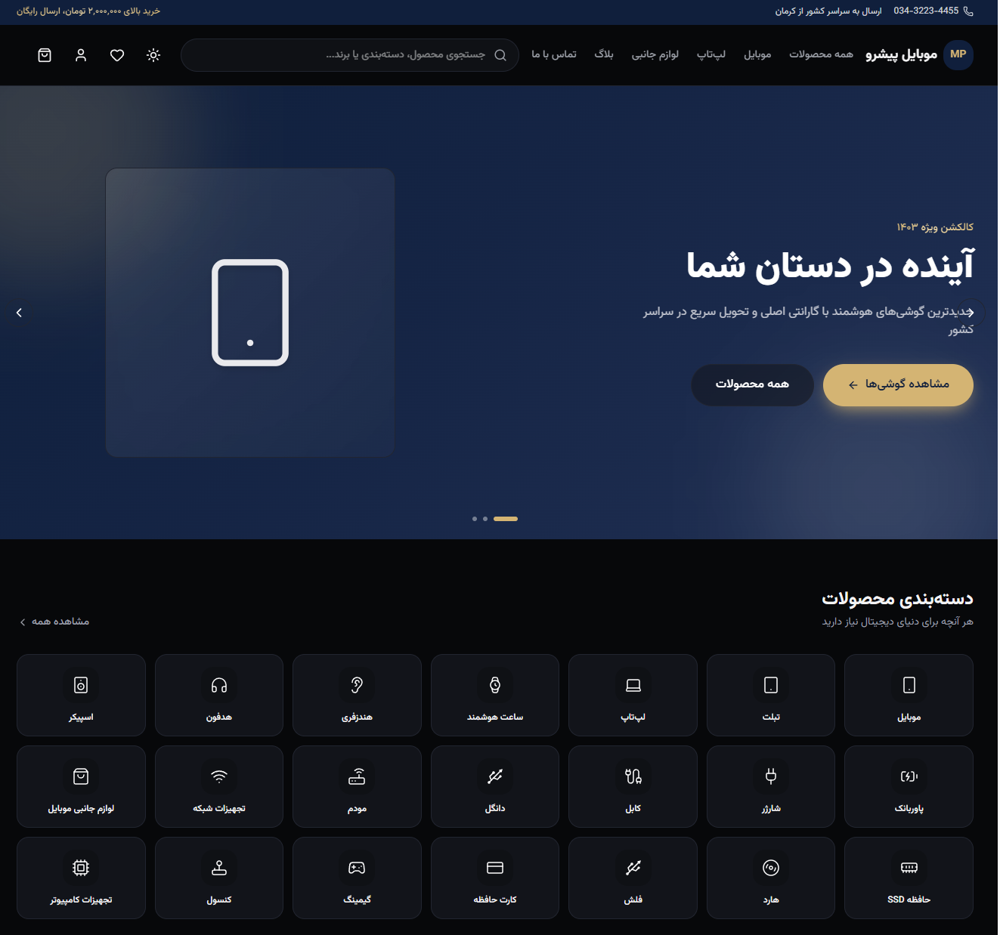
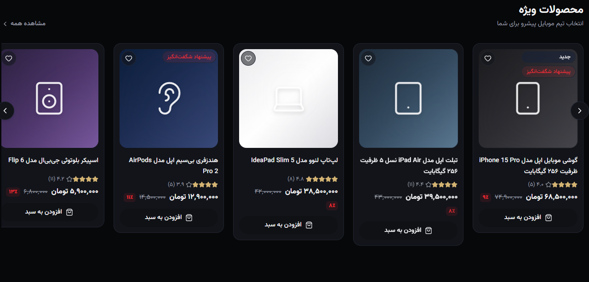
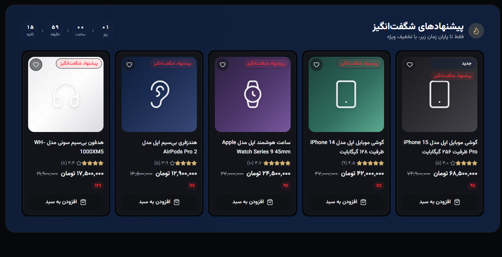
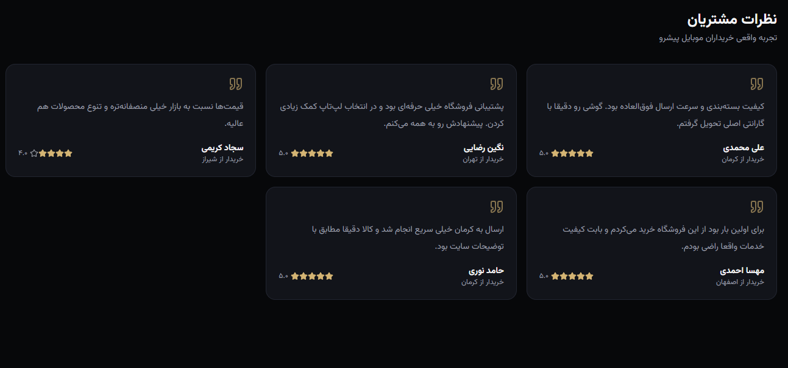

<div dir="rtl">

# موبایل پیشرو | Mobile Pishro

[English](README.md) | **فارسی**

یک فروشگاه اینترنتی مدرن و لوکس برای فروش محصولات دیجیتال و الکترونیک (موبایل، لپ‌تاپ، تبلت، تجهیزات گیمینگ و لوازم جانبی)، ساخته‌شده با Next.js App Router. کاملاً راست‌چین (RTL)، فارسی‌محور، و با طراحی‌ای که حس یک فروشگاه لوکس بین‌المللی را منتقل می‌کند نه یک قالب معمولی.

> **وضعیت پروژه:** فاز ۱ — فرانت‌اند کامل مشتری آماده است و به‌طور کامل روی داده‌های mock (شبیه‌سازی‌شده اما واقع‌گرایانه) کار می‌کند. برای اجرای پروژه به هیچ بک‌اند، دیتابیس یا کلید درگاه پرداختی نیاز نیست. برای مراحل بعدی به بخش [نقشه راه](#نقشه-راه--توسعه‌های-آینده) مراجعه کنید.

## پیش‌نمایش محلی

```bash
npm install
npm run dev
```

سپس آدرس `http://localhost:3000` را باز کنید. *(در صورت دیپلوی، لینک نسخه زنده را اینجا اضافه کنید.)*

## اسکرین‌شات‌ها

<p align="center">
  
</p>
<p align="center">
  
</p>
<p align="center">
  
</p>
<p align="center">
  
</p>

## معرفی پروژه

موبایل پیشرو یک فروشگاه فرضی (ساختگی) مستقر در کرمان است. این پروژه کل مسیر خرید یک فروشگاه واقعی را پیاده‌سازی می‌کند — مرور محصولات، فیلتر و جستجو، سبد خرید، تسویه حساب، احراز هویت، و پنل کاربری — با تمرکز بر انیمیشن روان، هماهنگی کامل حالت تیره/روشن، و طراحی کاملاً واکنش‌گرا (Responsive) موبایل‌محور.

تمام داده‌های محصولات، سفارش‌ها و حساب کاربری از یک لایه mock تایپ‌شده (`src/lib/mock`) تولید می‌شوند که طوری طراحی شده که دقیقاً شبیه یک اسکیمای دیتابیس واقعی باشد — این یعنی در آینده جایگزین کردن آن با یک بک‌اند واقعی، بدون نیاز به طراحی مجدد رابط کاربری، ساده خواهد بود.

## قابلیت‌های اصلی

- **صفحه اصلی** — اسلایدر هیرو با انیمیشن، دسته‌بندی محصولات، اسلایدرهای محصولات ویژه/پرفروش/جدید، بخش «پیشنهاد شگفت‌انگیز» با شمارش معکوس زنده، نوار برندها، نظرات مشتریان، پیش‌نمایش بلاگ و آکاردئون سوالات متداول.
- **لیست محصولات** — فیلتر بر اساس دسته‌بندی و برند، محدوده قیمت، فیلتر موجودی، مرتب‌سازی، و نوار جستجو با پیشنهاد لحظه‌ای.
- **صفحه محصول** — گالری تصاویر با افکت زوم روی هاور، انتخاب رنگ، جدول مشخصات فنی، نظرات کاربران، بخش پرسش و پاسخ، و محصولات مرتبط.
- **سبد خرید و تسویه حساب** — کنترل تعداد، پشتیبانی از کد تخفیف (`WELCOME10`، `PISHRO20`)، محاسبه خودکار سقف ارسال رایگان و مالیات، انتخاب آدرس، روش ارسال، و انتخاب درگاه پرداخت (زرین‌پال/زیبال به‌صورت ساختار آماده — به [نقشه راه](#نقشه-راه--توسعه‌های-آینده) مراجعه کنید).
- **احراز هویت (شبیه‌سازی‌شده)** — ورود با رمز عبور یا کد یکبار مصرف، ثبت‌نام، و فرآیند فراموشی رمز عبور با صفحه کد ۵ رقمی.
- **پنل کاربری** — پروفایل، تاریخچه سفارش‌ها با نمودار وضعیت پیگیری، علاقه‌مندی‌ها، آدرس‌های ذخیره‌شده، کیف پول با تاریخچه تراکنش، اعلان‌ها، و تیکت‌های پشتیبانی.
- **صفحه تماس با ما** — نقشه جاسازی‌شده، ساعات کاری، و فرم تماس.
- **سیستم طراحی** — تغییر حالت تیره/روشن، افکت‌های Glassmorphism، پالت رنگی لوکس طلایی/سرمه‌ای، انیمیشن‌های Framer Motion هنگام اسکرول/هاور/تغییر صفحه، و حالت‌های Skeleton Loading.
- **کاملاً واکنش‌گرا** — طراحی موبایل‌محور با نوار ناوبری پایین صفحه در موبایل و منوی کامل دسکتاپ در صفحات بزرگ‌تر.

## تکنولوژی‌های استفاده‌شده

| دسته | انتخاب |
| --- | --- |
| فریم‌ورک | [Next.js 16](https://nextjs.org/) (App Router، Turbopack) |
| زبان | TypeScript |
| استایل‌دهی | [Tailwind CSS v4](https://tailwindcss.com/) (تنظیمات مبتنی بر CSS) |
| انیمیشن | [Framer Motion](https://www.framer.com/motion/) |
| مدیریت state | [Zustand](https://github.com/pmndrs/zustand) (سبد خرید، علاقه‌مندی‌ها، احراز هویت، وضعیت UI) |
| آیکون‌ها | [lucide-react](https://lucide.dev/) |
| اسلایدر/کاروسل | [Embla Carousel](https://www.embla-carousel.com/) |
| اعلان‌ها | [react-hot-toast](https://react-hot-toast.com/) |
| فونت | [Vazirmatn](https://github.com/rastikerdar/vazirmatn) از طریق `next/font/google` |

## راه‌اندازی پروژه

### پیش‌نیازها

- Node.js نسخه ۲۰ به بالا
- npm (یا pnpm/yarn — دستورات را متناسب تغییر دهید)

### نصب

```bash
git clone <your-repo-url>
cd mobile-pishro
npm install
npm run dev
```

پروژه روی آدرس `http://localhost:3000` در دسترس خواهد بود. در این فاز به هیچ متغیر محیطی یا سرویس خارجی نیازی نیست.

### دستورات موجود

| دستور | توضیح |
| --- | --- |
| `npm run dev` | اجرای سرور توسعه (با Turbopack) |
| `npm run build` | ساخت نسخه Production |
| `npm run start` | اجرای سرور Production (بعد از `build`) |
| `npm run lint` | اجرای ESLint |

## متغیرهای محیطی

در فاز فعلی به هیچ متغیر محیطی نیازی نیست. فایل `.env.example` متغیرهایی را مستند کرده که در فازهای بعدی (دیتابیس، احراز هویت، و اتصال واقعی درگاه پرداخت) مورد نیاز خواهند بود (هنگام شروع آن فازها، این فایل را در `.env.local` کپی کنید).

## ساختار پوشه‌ها

```
src/
├── app/                  # مسیرهای صفحات (App Router)
│   ├── account/          # پنل کاربری (پروفایل، سفارش‌ها، علاقه‌مندی‌ها، آدرس‌ها، کیف پول، تیکت‌ها...)
│   ├── blog/             # لیست و صفحه تکی بلاگ
│   ├── cart/, checkout/  # سبد خرید و فرآیند تسویه حساب
│   ├── login/, register/, otp/, forgot-password/
│   ├── products/         # لیست محصولات + صفحه تکی [slug]
│   └── contact/, faq/
├── components/
│   ├── account/          # نشان وضعیت سفارش، دکمه فاکتور، سایدبار
│   ├── auth/              # قالب مشترک احراز هویت، صفحه OTP
│   ├── checkout/          # انتخاب‌گر آدرس و روش پرداخت
│   ├── home/               # هیرو، دسته‌بندی، بخش‌های محصول، سوالات متداول، خبرنامه...
│   ├── layout/             # هدر، فوتر، کشوی سبد خرید، ناوبری موبایل، نوار جستجو
│   ├── product/            # کارت محصول، گرید، کاروسل، گالری، فیلترها
│   ├── providers/          # تنظیم‌کننده تم، تنظیم‌کننده Toast
│   └── ui/                 # اجزای پایه سیستم طراحی (دکمه، نشان، برچسب قیمت، امتیازدهی...)
├── hooks/                 # هوک‌های کوچک قابل استفاده مجدد (مثل click-outside)
├── lib/
│   ├── mock/               # داده‌های mock تایپ‌شده: محصولات، دسته‌بندی‌ها، برندها، بلاگ، سوالات، سفارش‌ها...
│   ├── cart-helpers.ts     # محاسبه جمع سبد خرید، کدهای تخفیف، منطق مالیات/ارسال
│   ├── site-config.ts      # اطلاعات فروشگاه، اطلاعات تماس، لیست درگاه‌های پرداخت — منبع اصلی و یکپارچه
│   ├── types.ts             # تایپ‌های مشترک دامنه (منعکس‌کننده اسکیمای آینده دیتابیس)
│   └── utils.ts             # توابع کمکی فرمت‌دهی (ارز، اعداد فارسی و...)
└── store/                  # استورهای Zustand: سبد خرید، علاقه‌مندی‌ها، احراز هویت، وضعیت UI
```

## نکات طراحی

- تصاویر محصولات از ترکیب گرادیانت رنگی + آیکون (کامپوننت `ProductRender`) استفاده می‌کنند به‌جای عکس واقعی — این یک انتخاب آگاهانه برای حفظ یکپارچگی زبان بصری و پرهیز از مشکلات مجوز/هات‌لینک تصاویر در یک پروژه دمو بوده است.
- تمام قیمت‌ها به تومان و با اعداد فارسی از طریق `faDigits`/`formatToman` در `src/lib/utils.ts` فرمت می‌شوند.
- تنظیمات سراسری فروشگاه (اطلاعات تماس، ساعات کاری، لیست درگاه‌های پرداخت، سقف هزینه ارسال) در `src/lib/site-config.ts` قرار دارند تا بعداً به‌راحتی به یک جدول تنظیمات قابل‌ویرایش در پنل مدیریت متصل شوند.

## نقشه راه / توسعه‌های آینده

این مخزن، فاز ۱ از یک برنامه بزرگ‌تر را نمایش می‌دهد:

- [ ] **فاز ۲ — لایه داده:** PostgreSQL + Prisma، احراز هویت واقعی با NextAuth، جایگزینی داده‌های mock و استور Zustand با پایگاه داده واقعی.
- [ ] **فاز ۳ — پرداخت:** اتصال واقعی درگاه‌های زرین‌پال / زیبال پشت رابط کاربری انتخاب درگاه که از قبل آماده است.
- [ ] **فاز ۴ — پنل مدیریت:** مدیریت محصولات/سفارش‌ها/دسته‌بندی‌ها/تخفیف‌ها، آمار و داشبورد تحلیلی.
- [ ] **فاز ۵ — سئو و PWA:** sitemap.xml، robots.txt، داده‌های ساخت‌یافته (Schema.org)، مانیفست PWA قابل نصب، و بهینه‌سازی عملکرد/تصاویر.

## مجوز

این پروژه تحت [مجوز MIT](LICENSE) منتشر شده است. این یک پروژه نمونه‌کار/دمو است — تمام نام برند، لیست محصولات، و اطلاعات تماس فروشگاه کاملاً ساختگی هستند.

</div>
